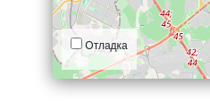

# Куда пойти — Москва 

Сайта о самых интересных местах в Москве. 


## Демо-версия сайта

Демо-версию сайта можно посмотреть на [AnneG8.pythonanywhere.com](AnneG8.pythonanywhere.com).

## Как установить

Python3 должен быть уже установлен. 
Затем используйте `pip` (или `pip3`, есть конфликт с Python2) для установки зависимостей:
```shell
pip install -r requirements.txt
```
Создайте файл **.env** в корне репозитория, добавьте в него **переменные окружения**:
- SECRET_KEY — секретный ключ проекта. По умолчанию - `REPLACE_ME`.
- ALLOWED_HOSTS — список допустимых хостов/доменных имен.
- DEBUG — дебаг-режим. Поставьте `True`, чтобы увидеть отладочную информацию в случае ошибки. По умолчанию - `False`.

Создайте базу данных:
```shell
python manage.py makemigrations
python manage.py migrate
```
Создайте суперпользователя:
```sh
python manage.py createsuperuser
```

### Как запустить

Запустите разработческий сервер:
```shell
python manage.py runserver
```

### Настройки

Внизу справа на странице можно включить отладочный режим логгирования.



Настройки сохраняются в Local Storage браузера и не пропадают после обновления страницы. Чтобы сбросить настройки, удалите ключи из Local Storage с помощью Chrome Dev Tools —&gt; Вкладка Application —&gt; Local Storage.

Если что-то работает не так, как ожидалось, то начните с включения отладочного режима логгирования.

<a href="#" id="data-sources"></a>

### Используемые библиотеки

* [Leaflet](https://leafletjs.com/) — отрисовка карты
* [loglevel](https://www.npmjs.com/package/loglevel) для логгирования
* [Bootstrap](https://getbootstrap.com/) — CSS библиотека
* [Vue.js](https://ru.vuejs.org/) — реактивные шаблоны на фронтенде

### Цели проекта

Код написан в учебных целях — это урок в курсе по Python и веб-разработке на сайте [Devman](https://dvmn.org).

Тестовые данные взяты с сайта [KudaGo](https://kudago.com).
